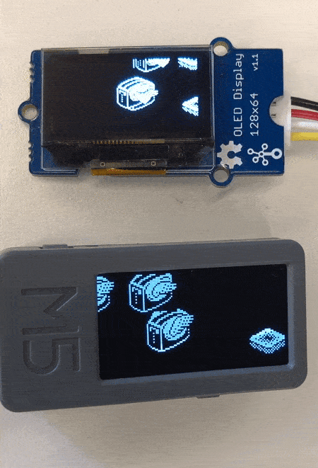

# Flying Toasters

- Adafruit의 [Animated Flying Toaster OLED Jewelry](https://learn.adafruit.com/animated-flying-toaster-oled-jewelry) 내용을 보고 OLED 및 M5Stick에 포팅하여 테스트한 내용.
- OLED: Adafruit SSD1306 라이브러리 사용
- M5Stick: u8g2라이브러리 사용

